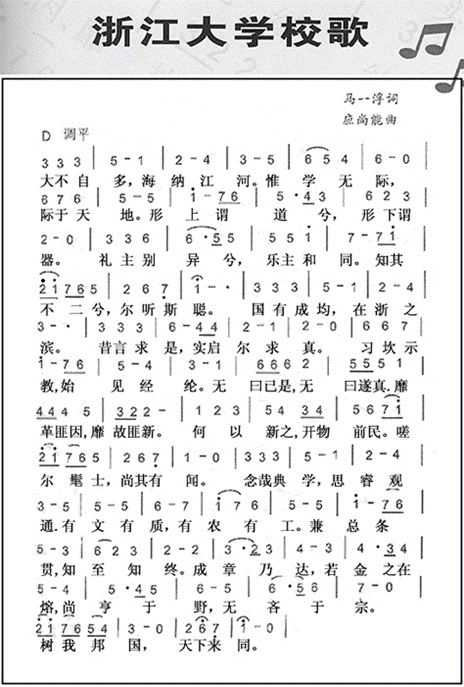

# 浙大校歌

## 校歌来源

1938年，校务工作会议确定了“求是”校训后，学校决定邀请著名国学家马一浮编写校歌歌词。由于歌词引用了较多古典，使用文言文，艰深晦涩，不够通俗，有时读起来比较拗口，竺可桢校长曾考虑改写。但又考虑到歌词随文理艰深，但含义深远，很能体现浙江大学所追求的求是精神，于是歌词未改，并邀请国立中央音乐学院的应尚能教授谱曲，并最终经校务会议通过，确定为浙江大学校歌，定名为《大不自多》。

## 校歌词曲

大不自多，海纳江河。惟学无际，际于天地。形上谓道兮，形下谓器。礼主别异兮，乐主和同。知其不二兮，尔听斯聪。

国有成均，在浙之滨。昔言求是，实启尔求真。习坎示教，始见经纶。无曰已是，无曰遂真，靡革匪因，靡故匪新。何以新之，开物前民。嗟尔髦士，尚其有闻。

念哉典学，思睿观通。有文有质，有农有工。兼总条贯，知至知终。成章乃达，若金之在熔，尚亨于野，无吝于宗。树我邦国，天下来同。

## 校歌翻译

大海浩瀚而不自满，所以能容纳千万条江河。

学问的世界无边无际，抵达天地的尽头。

形而上的称为“道”，形而下的称为“器”。

礼制主导世界的差异，音乐使社会和谐共存。

明白其中的辩证统一关系，就会更加聪慧和明智。

---

有一所国立大学，在中国东南的浙水之滨。

它以求是为宗旨，其实就是启迪人们求真。

持之以恒潜心教学，才能逐步加深对世界的认识。

不要说已把握事物的本质，也不要说已穷尽真理。

没有什么变革不需要继承，没有什么传统不可以创新。

怎样改革创新？实践探索奋勇争先。

诸位年轻的英才，应当明了这些重要道理。

---

要致力于学问，以达到思想睿智、见识通达。

我们有人文、科学、农业、技术等多种学科。

要融会贯通，掌握知识的源流和实践运用。

像金子在熔炉中一样，锻造伟大的成果。

立足于民众才能取得真正的成功，不要被宗派门户所束缚。

努力振兴祖国，使世界各国人民和谐相处。
